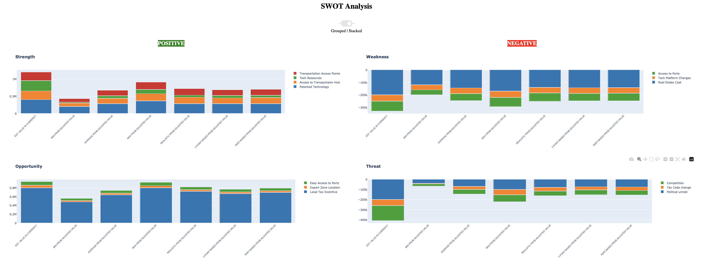
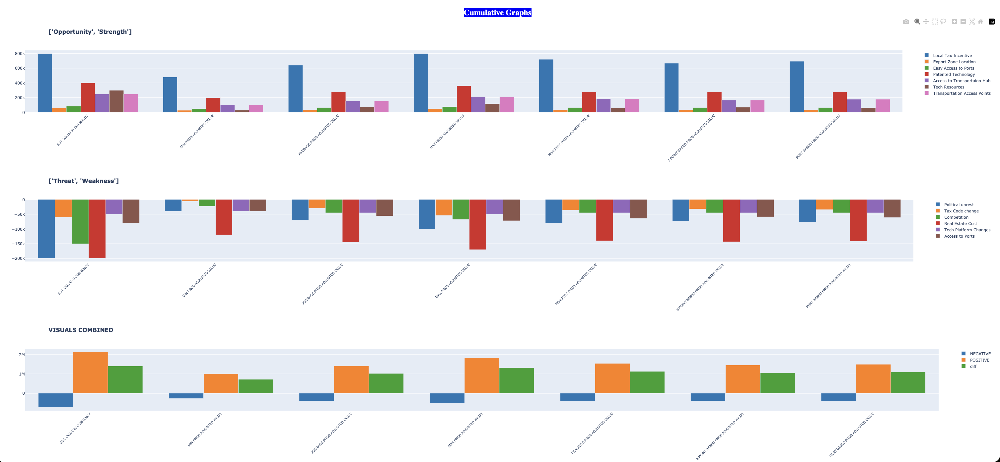

# Swot Analysis

## Datas

Data reFormatted by Categories

Section of data that is extracted from the previous dataframe by category.

Dataframe that shows the aggregates of all positive attributes and the negative attribrutes. Then has another row section that has the differences
between them.

## Graphs:

## stacked bar version 

## Cumulative graphs of the data

